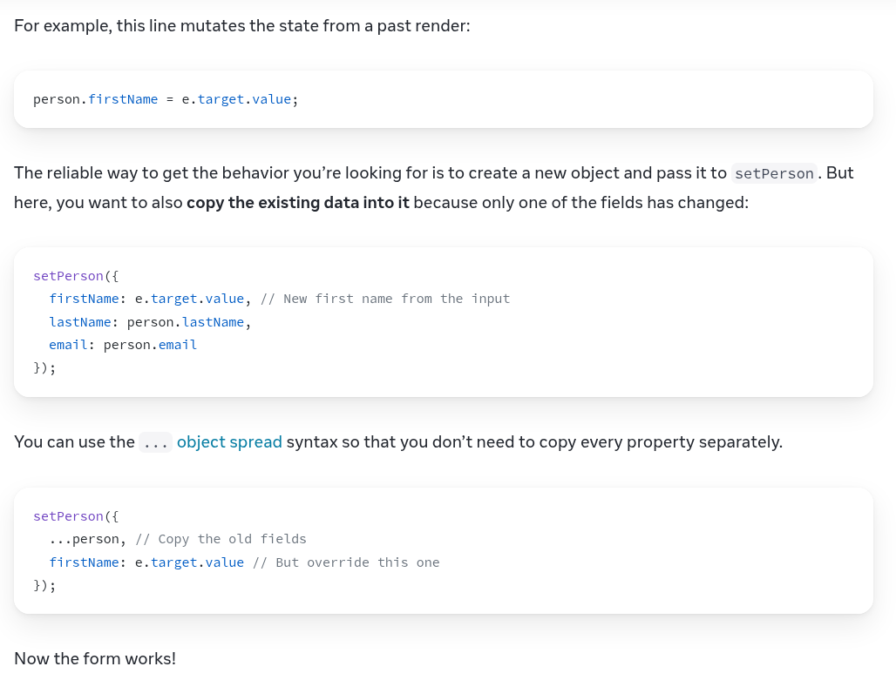
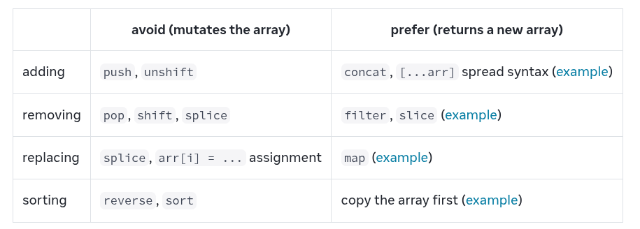
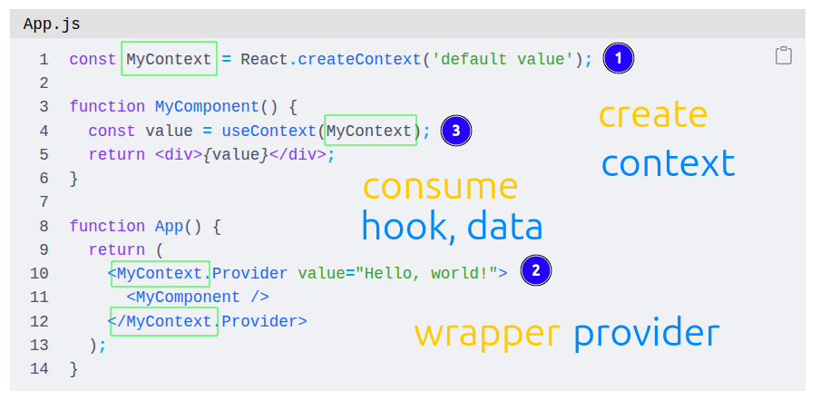
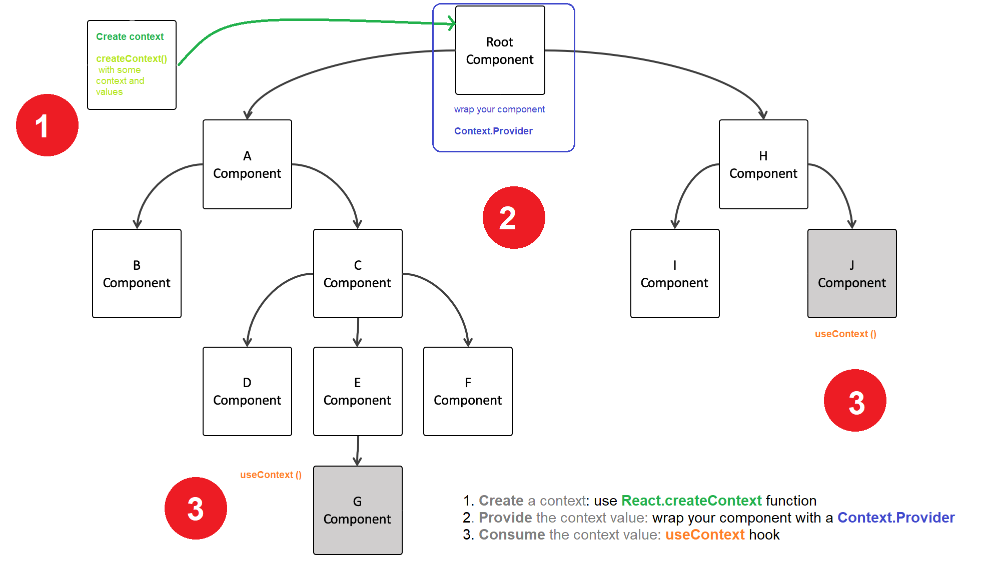
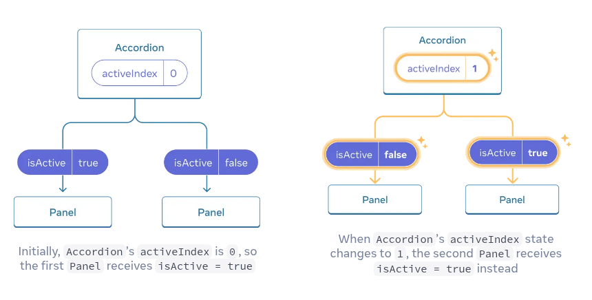
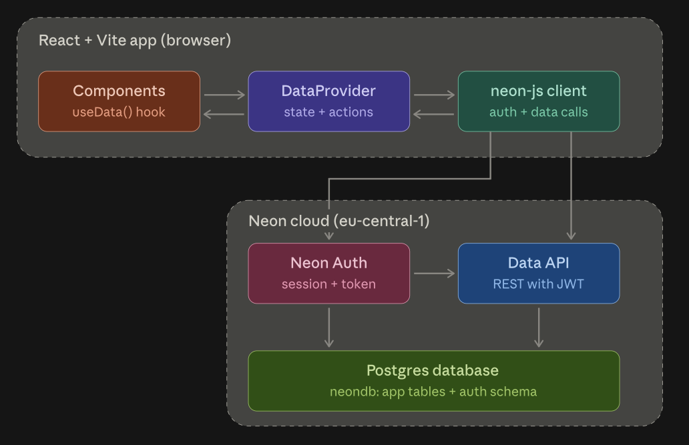

{width="30%"}

::: {.column-page-right}

##  ``Sprint#10: CompassMap React II`` (16 - 20 November 2026)

| # | Day | Date | Topics |  Details Topics |
| -- | -- | -- | -- | -- |
| **#10** | 35 | 16/11/26 | - Plan Sprint#10     - React: follow Friday   - Component `skeleton`: event, `onChange`, handlers, state, conditional render   - `ECMA6`: `spread` operator   - Render cycle: `useState`, immutability   - Basic React Register Form     - React: `sculptures` sandbox   (1) App: navigate different views   (2) `switch` case: conditional render   (3) Copying objects with the `spread` syntax   (4) `...spread` operator   (5) Updating **objects** in state   (6) Updating **arrays** in state     ++ How to build a `React Component`? How to think a `React Component`?   ++ **Skeleton**:   (1) trigger (render)   (2) handler (`setPerson()`)   (3) call the hook with the new literal object (`setPerson()`)   (4) state `setPerson` is executed with new literal object   (5) new render   ++ PRA: React Practice Exercise — Sculptures CRUD App | - [React Principles](/reactjs/reactjs-what-principles.qmd){.external target='_blank'}   - [Events](/reactjs/reactjs-app-events.qmd){.external target='_blank'} / [Conditional render](/reactjs/reactjs-app-conditional-render.qmd){.external target='_blank'}   - [Spread](/reactjs/reactjs-es6-spread.qmd){.external target='_blank'} / [JavaScript ES6](https://www.w3schools.com/js/js_es6.asp){.external target='_blank'}   - [`useState`](/reactjs/reactjs-hook-state.qmd){.external target='_blank'}   - [React Render Cycle](https://diagrammersamples.s3.eu-central-1.amazonaws.com/React-Render-Cycle.html){.external target='_blank'} / [Playground](https://diagrammersamples.s3.eu-central-1.amazonaws.com/Render_Cycle_Playground.html){.external target='_blank'}   - [basicRegisterForm](https://github.com/AlbertProfe/basicRegisterForm){.external target='_blank'}     {.lightbox width=100% fig-align="center"}   - [Sculptures Wiki](https://github.com/AlbertProfe/sculptures/wiki){.external target='_blank'}   - [Sculptures CodeSandBox](https://codesandbox.io/p/sandbox/sculptures-9p8mp6){.external target='_blank'}   {.lightbox width=100% fig-align="center"}   - [Updating Objects in State](https://react.dev/learn/updating-objects-in-state){.external target='_blank'}   - [Updating Arrays in State](https://react.dev/learn/updating-arrays-in-state){.external target='_blank'}     {.lightbox width=100% fig-align="center"}   - [PRA: React Sculptures CRUD Practice](https://github.com/AlbertProfe/compassMap/blob/master/docs/pra/React%20Sculptures%20CRUD%20Practice.md){.external target='_blank'}   - [Discussion #13: Code dev](https://github.com/AlbertProfe/wiki/discussions/13#discussion-11322402){.external target='_blank'} |
|  | 36 | 17/11/26 | <s>- Full Stack: `Spring Boot` + `React`</s>   <s>- New flow: `assessmentView`</s>   <s>- `AssessmentView`: rebuild Q&A list</s>     - React: **sculptures** sandbox   (1) App: navigate different views   (2) `switch` case: conditional render   (3) Updating **objects** in state   (4) Updating **arrays** in state   (5) Remove object from array     ++ `Sculptures` sandbox project: add, delete, nav bar, filter     ++ How do programming paradigms differ?   ++ Typing, mutability, sync, scope, scalability | - [assessment-qa-rebuild-diagram](https://diagrammersamples.s3.eu-central-1.amazonaws.com/assessment-qa-rebuild-diagram.html){.external target='_blank'}   - [CompassMap masterDoc v2](https://github.com/AlbertProfe/compassMap/blob/master/docs/compassMap_v2.md){.external target='_blank'}   - [assessmentview-rest-v2](https://github.com/AlbertProfe/compassMap/blob/master/docs/appends/assessmentview-rest-v2.md){.external target='_blank'}   - [compassMap-React summary v1.1](https://github.com/AlbertProfe/compassMap/blob/master/docs/appends/compassMap-React-summary-v1.1.md){.external target='_blank'}     - [Removing from an array](https://react.dev/learn/updating-arrays-in-state#removing-from-an-array){.external target='_blank'}   {.lightbox width=100% fig-align="center"}   - [PRA: React Sculptures CRUD Practice](https://github.com/AlbertProfe/compassMap/blob/master/docs/pra/React%20Sculptures%20CRUD%20Practice.md){.external target='_blank'}   - [Sculptures Wiki](https://github.com/AlbertProfe/sculptures/wiki){.external target='_blank'} |
|  |  | 18/11/26 | |  |
|  | 37 | 19/11/26 | - React: `sculptures` sandbox   (1) App: navigate different views   (2) `switch` case: conditional render   (3) `...spread` operator   (4) Updating **arrays** in state     <s>- `useEffect`: intro</s>     ++ `useContext`: intro   ++ React: `sculptures` sandbox: `react-router-dom`, css, context, previous-next, like | - [Sculptures Wiki](https://github.com/AlbertProfe/sculptures/wiki){.external target='_blank'}   - [Sculptures CodeSandBox](https://codesandbox.io/p/sandbox/sculptures-9p8mp6){.external target='_blank'}   {.lightbox width=100% fig-align="center"}   {.lightbox width=100% fig-align="center"}   - [Updating Arrays in State](https://react.dev/learn/updating-arrays-in-state#adding-to-an-array){.external target='_blank'}   - [`useEffect`](/reactjs/reactjs-hook-effect.qmd){.external target='_blank'} / [`useContext`](/reactjs/reactjs-hook-context.qmd){.external target='_blank'}     - [PRA: React Sculptures CRUD Practice](https://github.com/AlbertProfe/compassMap/blob/master/docs/pra/React%20Sculptures%20CRUD%20Practice.md){.external target='_blank'} / [Sculptures exercise](https://github.com/AlbertProfe/sculptures/blob/main/docs/exercise.md){.external target='_blank'}   {.lightbox width=100% fig-align="center"}   - [sculptures: neon-api-rest branch](https://github.com/AlbertProfe/sculptures/tree/neon-api-rest){.external target='_blank'} |
|  | 38 | 20/11/26 | <s>- Project: `compassMap-react`: updating **arrays** in state</s>   <s>(1) `assessmentView` object: fetch with `Axios`</s>   <s>(2) Render the 3 questions from the `assessmentView`</s>   <s>(3) User answers the 3 questions: `onChange`, `useState`</s>   <s>(4) Update the `answers` array immutably: `...spread`, `map`</s>   <s>(5) Submit the answers: `Axios` `POST` to `Spring Boot`</s>     ++ React: `Context` & sharing state   (1) Sharing state between components: lifting state up   (2) Data top-down (`props`), state down-top (callbacks)   (3) Prop drilling: the problem   (4) `createContext`: create the context   (5) `Provider`: provide the value   (6) `useContext`: consume the value     ++ React: `sculptures` backend: `Neon`   (1) `Neon` project: Postgres + Data API (REST) + Neon Auth (anonymous)   (2) `sculptures` table: `CREATE`, `INSERT`, `GRANT SELECT` to `anonymous`, RLS policy   (3) React (Vite): `@neondatabase/neon-js` client, `useEffect` fetch, render list | {.lightbox width=100% fig-align="center"}   {.lightbox width=100% fig-align="center"}   - [Sharing State Between Components](https://react.dev/learn/sharing-state-between-components){.external target='_blank'} / [`useContext`](/reactjs/reactjs-hook-context.qmd){.external target='_blank'} / [Props: passing props down, state up](/reactjs/reactjs-what-props.qmd#example-passing-props-down-state-up){.external target='_blank'}     - [Sculptures Wiki: Backend Neon](https://github.com/AlbertProfe/sculptures/wiki/Backend:-Neon){.external target='_blank'} / [sculptures: neon-api-rest branch](https://github.com/AlbertProfe/sculptures/tree/neon-api-rest){.external target='_blank'}   {.lightbox width=100% fig-align="center"}     - [Updating Arrays in State](https://react.dev/learn/updating-arrays-in-state){.external target='_blank'}   - [assessment-qa-rebuild-diagram](https://diagrammersamples.s3.eu-central-1.amazonaws.com/assessment-qa-rebuild-diagram.html){.external target='_blank'}   - [assessmentview-rest-v2](https://github.com/AlbertProfe/compassMap/blob/master/docs/appends/assessmentview-rest-v2.md){.external target='_blank'} |

: Backlog course Sprint#10 November 2026 table {tbl-colwidths="[2,2,2,60,34]"}
:::

::: {.callout-note}
- `-` topic planned or done
- `----` topic pending to future
- `++` new topic not planned
:::
